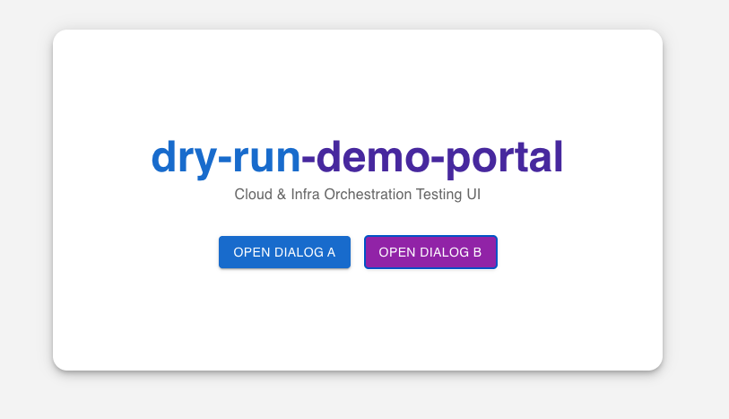
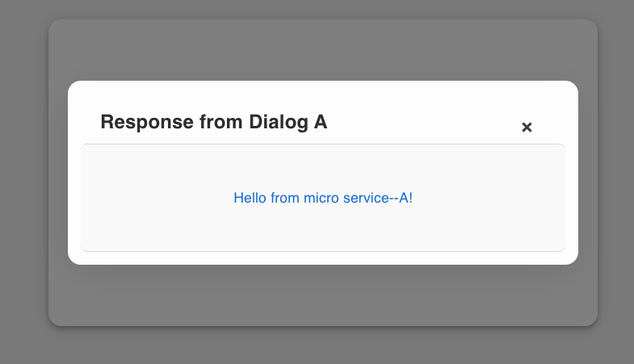

# dry-run-demo-app

## 🖼️ Screenshots

### ✅ Planned UI Design

  
_Initial mockup for `dry-run-demo-app`_

---

### Actual App Output

  
_Live UI showing dialog buttons and styled portal layout_

### Actual App Output - Dialog Interaction



## Overview

**dry-run-demo-app** is a monorepo project containing:

- 🟢 React Frontend (Vite)
- 🟠 Node.js Microservice A (`service-dialog-a`)
- 🟡 Node.js Microservice B (`service-dialog-b`)

## Technologies Used

- React 18
- Vite
- Node.js
- Express.js
- npm

## Prerequisites

- Node.js v16 or higher (recommended)
- npm v8 or higher (or pnpm if preferred)
- Internet connection for dependency installation

## Localhost URLs

| Component         | Description                 | URL                                            |
| ----------------- | --------------------------- | ---------------------------------------------- |
| 🟢 Frontend       | React Vite UI               | [http://localhost:5173](http://localhost:5173) |
| 🟠 Microservice A | Express Service (Port 3001) | [http://localhost:3001](http://localhost:3001) |
| 🟡 Microservice B | Express Service (Port 3002) | [http://localhost:3002](http://localhost:3002) |

## Setup & Installation

1. **Clone the repository**

   ```bash
   git clone git@github.com:ramachandraprabu/dry-run-demo-app.git
   cd dry-run-demo-app

   ```

2. **Install root dependencies**

   ```bash
   npm install

   ```

3. **Install root dependencies**
   Run from the root directory

   ```bash
   npm install
   ```

4. **Install concurrently**

   ```bash
   npm install concurrently --save-dev
   ```

5. **Start all services and frontend concurrently**

   ```bash
   npm run start:all
   ```


### To run the docker 
```sh
docker compose up -d
```

Then access using `http://localhost:80`