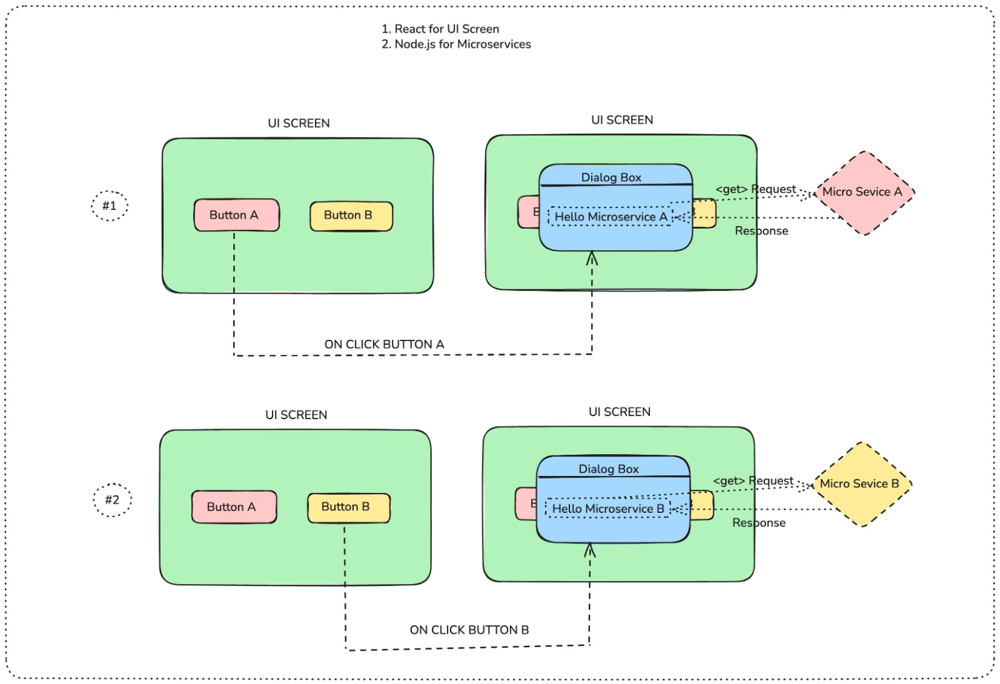

# dry-run-demo-app

 <!-- Replace with your actual image path -->

## Overview

**dry-run-demo-app** is a monorepo project containing:

- 🟢 React Frontend (Vite)  
- 🟠 Node.js Microservice A (`service-dialog-a`)  
- 🟡 Node.js Microservice B (`service-dialog-b`)  

## Technologies Used

- React 18  
- Vite  
- Node.js  
- Express.js  
- npm  

## Prerequisites

- Node.js v16 or higher (recommended)  
- npm v8 or higher (or pnpm if preferred)  
- Internet connection for dependency installation  

## Localhost URLs

| Component         | Description                | URL                             |
|-------------------|----------------------------|--------------------------------|
| 🟢 Frontend       | React Vite UI               | [http://localhost:5173](http://localhost:5173) |
| 🟠 Microservice A | Express Service (Port 3001) | [http://localhost:3001](http://localhost:3001) |
| 🟡 Microservice B | Express Service (Port 3002) | [http://localhost:3002](http://localhost:3002) |

## Setup & Installation

1. **Clone the repository**

   ```bash
   git clone <your-repo-url>
   cd dry-run-demo-app

2. **Install root dependencies**

   ```bash
   npm install

3. **Install root dependencies**

   ```bash
   cd packages/frontend
   npm install
   cd ../service-dialog-a
   npm install
   cd ../service-dialog-b
   npm install
   cd ../../

3. **Install concurrently**

    ```bash
    npm install concurrently --save-dev

4. **Start all services and frontend concurrently**

    ```bash
    npm run start:all


